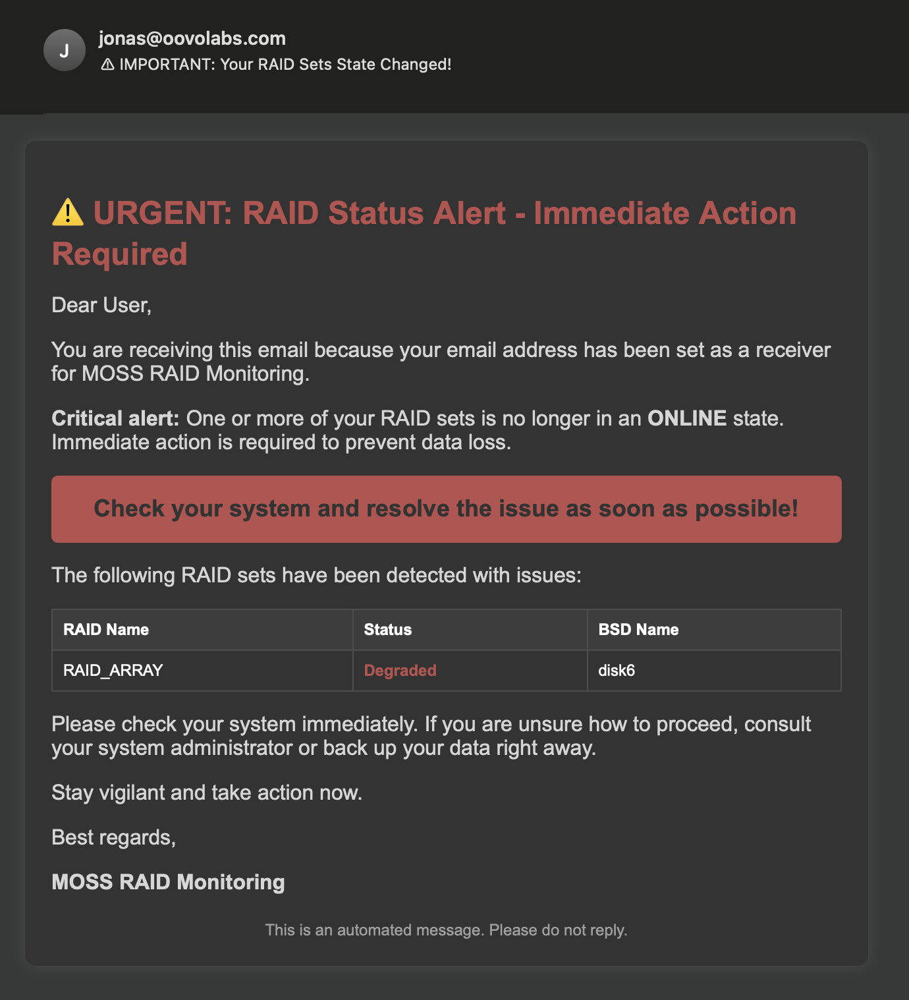

# 💾 MOSS RaidMON

RaidMON is a tool for monitoring the health of RAID arrays on macOS. It periodically checks the status of all RAID sets and sends an email notification if any of them are degraded or failed.



I've build this in a Day to monitor my own RAID setup since raideye is not supported on newer macOS versions. Follow the instructions below to set it up on your own system.

# 📋 Features
- **Email notifications** 
  - Receive alerts when a RAID set is degraded or failed.
  - Customize email templates.

- **Auto-start on boot**
  - Run the installer script to set auto-start on boot.

- **Customizable settings**
   - Configure the monitoring interval and email settings.

# Installation

## 📦 Setup (from release)  

1. **Download the latest release**  
   - Get the latest version from the [Releases](#) page.  

2. **Extract the contents**  
   \```bash
   tar -xzf moss_raidmon.tar.gz
   cd moss_raidmon
   \```  

3. **Configure notifications**  
   - Edit `config/config.yml` to add your mail server details and the recipient email.  

4. **Enable auto-start**  
   - Run the setup script:  
     \```bash
     ./install.sh
     \```  

5. **Done!** MOSS RaidMON is now set up and ready to monitor your drives.  


---

## 🚀 Setup (from source)  

1. **Clone the repository**  
   \```bash
   git clone <repository-url>
   cd <repository-folder>
   \```  

2. **Install dependencies**  
   \```bash
   go mod vendor
   \```  

3. **Build the project**  
   \```bash
   make release
   \```  

4. **Prepare the release folder**  
   - The `release` folder will contain the compiled binary, configuration files, and additional assets.  
   - Customize the configuration file (`config/config.yml`) with your mail server settings and the email where notifications should be sent.  

5. **Enable auto-start**  
   - Use the provided script to install the service:  
     \```bash
     ./install.sh
     \```  

6. **Done!** MOSS RaidMON will now run in the background and notify you of failing drives.  

---

### ℹ️ Notes  
- This tool is **macOS-only** and requires Go for building from source.  
- Logs and errors can be checked in `~/Library/Logs/moss_raidmon.log`.  
